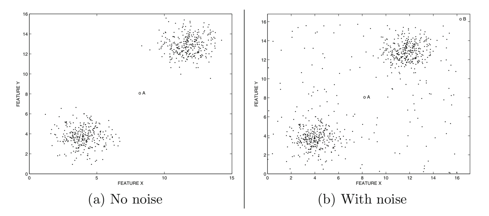

# 异常分析简介


- [异常分析简介](#%E5%BC%82%E5%B8%B8%E5%88%86%E6%9E%90%E7%AE%80%E4%BB%8B)
  - [1.1 简介](#11-%E7%AE%80%E4%BB%8B)
  - [1.2 数据模型就是一切](#12-%E6%95%B0%E6%8D%AE%E6%A8%A1%E5%9E%8B%E5%B0%B1%E6%98%AF%E4%B8%80%E5%88%87)
    - [1.2.1 与有监督模型的联系](#121-%E4%B8%8E%E6%9C%89%E7%9B%91%E7%9D%A3%E6%A8%A1%E5%9E%8B%E7%9A%84%E8%81%94%E7%B3%BB)
  - [1.3 基本异常值检测模型](#13-%E5%9F%BA%E6%9C%AC%E5%BC%82%E5%B8%B8%E5%80%BC%E6%A3%80%E6%B5%8B%E6%A8%A1%E5%9E%8B)
    - [1.3.1 异常值检测中的特征选择](#131-%E5%BC%82%E5%B8%B8%E5%80%BC%E6%A3%80%E6%B5%8B%E4%B8%AD%E7%9A%84%E7%89%B9%E5%BE%81%E9%80%89%E6%8B%A9)
    - [1.3.2 极值分析](#132-%E6%9E%81%E5%80%BC%E5%88%86%E6%9E%90)
    - [1.3.3 概率和统计模型](#133-%E6%A6%82%E7%8E%87%E5%92%8C%E7%BB%9F%E8%AE%A1%E6%A8%A1%E5%9E%8B)
    - [1.3.4 线性模型](#134-%E7%BA%BF%E6%80%A7%E6%A8%A1%E5%9E%8B)
    - [1.3.4.1光谱模型](#1341%E5%85%89%E8%B0%B1%E6%A8%A1%E5%9E%8B)
    - [1.3.5基于邻近的模型](#135%E5%9F%BA%E4%BA%8E%E9%82%BB%E8%BF%91%E7%9A%84%E6%A8%A1%E5%9E%8B)
    - [1.3.6信息理论模型](#136%E4%BF%A1%E6%81%AF%E7%90%86%E8%AE%BA%E6%A8%A1%E5%9E%8B)
    - [1.3.7高维异常值检测](#137%E9%AB%98%E7%BB%B4%E5%BC%82%E5%B8%B8%E5%80%BC%E6%A3%80%E6%B5%8B)
  - [1.4 异常集成方法](#14-%E5%BC%82%E5%B8%B8%E9%9B%86%E6%88%90%E6%96%B9%E6%B3%95)
    - [1.4.1顺序合奏](#141%E9%A1%BA%E5%BA%8F%E5%90%88%E5%A5%8F)
    - [1.4.2独立合奏](#142%E7%8B%AC%E7%AB%8B%E5%90%88%E5%A5%8F)
  - [1.5分析的基本数据类型](#15%E5%88%86%E6%9E%90%E7%9A%84%E5%9F%BA%E6%9C%AC%E6%95%B0%E6%8D%AE%E7%B1%BB%E5%9E%8B)
    - [1.5.1分类，文本和混合属性](#151%E5%88%86%E7%B1%BB%E6%96%87%E6%9C%AC%E5%92%8C%E6%B7%B7%E5%90%88%E5%B1%9E%E6%80%A7)
    - [1.5.2当数据值具有依赖关系时](#152%E5%BD%93%E6%95%B0%E6%8D%AE%E5%80%BC%E5%85%B7%E6%9C%89%E4%BE%9D%E8%B5%96%E5%85%B3%E7%B3%BB%E6%97%B6)
      - [1.5.2.1时间序列数据和数据流](#1521%E6%97%B6%E9%97%B4%E5%BA%8F%E5%88%97%E6%95%B0%E6%8D%AE%E5%92%8C%E6%95%B0%E6%8D%AE%E6%B5%81)
      - [1.5.2.2离散序列](#1522%E7%A6%BB%E6%95%A3%E5%BA%8F%E5%88%97)
      - [1.5.2.3空间数据](#1523%E7%A9%BA%E9%97%B4%E6%95%B0%E6%8D%AE)
    - [1.5.2.4网络和图形数据](#1524%E7%BD%91%E7%BB%9C%E5%92%8C%E5%9B%BE%E5%BD%A2%E6%95%B0%E6%8D%AE)
  - [1.6监督离群检测](#16%E7%9B%91%E7%9D%A3%E7%A6%BB%E7%BE%A4%E6%A3%80%E6%B5%8B)
  - [1.7异常值评估技术](#17%E5%BC%82%E5%B8%B8%E5%80%BC%E8%AF%84%E4%BC%B0%E6%8A%80%E6%9C%AF)
    - [1.7.1解释ROC AUC](#171%E8%A7%A3%E9%87%8Aroc-auc)
    - [1.7.2基准测试中的常见错误](#172%E5%9F%BA%E5%87%86%E6%B5%8B%E8%AF%95%E4%B8%AD%E7%9A%84%E5%B8%B8%E8%A7%81%E9%94%99%E8%AF%AF)
  - [1.8结论和总结](#18%E7%BB%93%E8%AE%BA%E5%92%8C%E6%80%BB%E7%BB%93)
  - [1.9书目调查](#19%E4%B9%A6%E7%9B%AE%E8%B0%83%E6%9F%A5)
  - [1.10练习](#110%E7%BB%83%E4%B9%A0)


> *“Never take the comment that you are different as a condemnation, it might be a compliment. It might mean that you possess unique qualities that, like the most rarest of diamonds is . . . one of a kind.”* – Eugene Nathaniel Butler

---

## 1.1 简介

异常值是与其余数据显着不同的数据点。 *Hawkins*定义[249]异常值如下：

> *“异常值是一种观察结果，与其他观察结果有很大差异，以至于会让人怀疑它是由不同的机制产生。”*

异常值（Outliers）在数据挖掘和统计文献中也被称为*异常*，*不一致*，*偏差*或*异常*。 在大多数应用程序中，数据由一个或多个生成过程创建，这些过程可以反映系统中的活动或收集的有关实体的观察结果。 当生成过程表现异常时，会导致异常值的产生。 因此，异常值通常包含有关影响数据生成过程的系统和实体的异常特征的有用信息。 对这些不寻常特征的识别提供了有用的特定于应用的见解。 一些例子如下：
- 系统入侵检测：在许多计算机系统中，收集有关操作系统调用，网络流量或其他用户操作的不同类型的数据。 因为一些有恶意的活动，这些数据可能会显现出一些异常行为。 对此类活动的识别称为入侵检测。
- 信用卡欺诈：信用卡欺诈越来越普遍，因为信用卡号等敏感信息可以更容易受到损害。 在许多情况下，未经授权使用信用卡可能会显示不同的模式，例如从特定地点购买特权或非常大的交易。 这些模式可用于检测信用卡交易数据中的异常值。
- 有趣的传感器事件：传感器通常用于跟踪许多实际应用中的各种环境和位置参数。基础模式的突然变化可能代表感兴趣的事件。事件检测是传感器网络领域的主要应用之一。正如本书后面所讨论的，事件检测是异常检测的一个重要时间版本。
- 医疗诊断：在许多医疗应用中，数据来自各种设备，如磁共振成像（MRI）扫描，正电子发射断层扫描（PET）扫描或心电图（ECG）时间序列。这些数据中的不寻常模式通常反映疾病状况。
- 执法：异常检测在执法中许多应用，特别是在只能通过实体的多种行为随时间发现异常模式的情况下。确定金融交易，交易活动或保险索赔中的欺诈通常需要识别由犯罪实体的行为产生的数据中的异常模式。
- 地球科学：通过卫星或遥感等各种机制收集大量关于天气模式，气候变化或土地覆盖模式的时空数据。此类数据中的异常情况可提供有关人类活动或环境趋势的重要见解，这可能是潜在原因。

在所有这些应用中，数据具有“正常”模型，并且异常被识别为与该正常模型的偏差。 正常数据点有时也称为*内点*（inliers）。 在诸如入侵或欺诈检测的一些应用中，异常值对应于多个数据点的序列而不是单个数据点。 例如，欺诈事件通常可以反映个体在特定序列中的行为。 序列的特异性与识别异常事件有关。 这种异常也被称为集体异常，因为它们只能从一组或一系列数据点集体推断出来。 这种集体异常通常是产生异常活动模式的异常事件的结果。 本书将解决这些不同类型的异常。

异常检测算法的输出可以是以下两种类型之一：
- 异常值：大多数离群值检测算法输出一个量化每个数据点“离群值”水平的分数。 该分数还可用于按其异常趋势的顺序对数据点进行排名。 这是一种非常通用的输出形式，它保留了特定算法提供的所有信息，但它没有提供应被视为异常值的少量数据点的简明摘要。
- 二分类标签：第二种类型的输出是二分类标签，指示数据点是否是异常值。 虽然某些算法可能直接返回二分类标签，但异常值也可以转换为二分类标签。 这通常通过对异常值得分施加阈值来实现，并且基于得分的统计分布来选择阈值。 二分类标记包含的信息少于评分机制，但它是实际应用中决策制定通常需要的最终结果。



<center>图1.1：噪声和异常之间的差异</center>


<center>图1.2：从正常数据到异常值的频谱</center>

关于什么构成了一个被认为是异常值的点的“充分”偏差，通常是一种主观判断。 在实际应用中，数据可能被嵌入了大量的噪声，这种噪音分析师可能不感兴趣。但这通常又是令人感兴趣的非常有趣的偏差。为了说明这一点，请考虑图1.1（a）和（b）中所示的示例。很明显，数据中的主要模式（或集群）在两种情况下都是相同的，尽管这些主要集群之外存在显着差异。在图1.1（a）的情况下，单个数据点（标记为“A”）似乎与其余数据非常不同，因此非常明显是异常。图1.1（b）中的情况更为主观。虽然图1.1（b）中的相应数据点“A”也处于数据的稀疏区域，但更难以自信地表明它表示与剩余数据集的真实偏差。该数据点很可能代表数据中随机分布的噪声。这是因为点'A'似乎更匹配一种由其他随机分布点表示的模式。因此，在本书中，术语“离群值（outlier）”指的是可被视为异常或噪声的数据点，而“异常（anomaly）”指的是分析人员感兴趣的特殊异常值。

在*无监督场景*中，前面的有趣异常示例将不可用，噪声代表正常数据和真实异常之间的语义边界-噪声通常被建模为弱形式的异常值，并不总是满足那些被认为是有趣的或异常的数据所需的强标准。 例如，集群边界处的数据点通常可被视为噪声。通常，大多数离群值检测算法使用数据点的离群值的一些量化度量，例如基础区域的稀疏性，基于最近邻点的距离，或者对基础数据分布的拟合。每个数据点都位于从正常数据到噪声的连续谱上，最后是异常，如图1.2所示。该频谱的不同区域的分离通常不是精确定义的，并且是根据应用特定标准在临时基础上选择的。此外，噪声和异常之间的分离并不是纯粹的，并且由嘈杂的生成过程产生的许多数据点可能带具有足够的偏差，而基于离群值得分会被解释为异常。因此，异常通常具有比噪声高得多的离群分值，但这不是两者之间的区别因素。相反，分析师的兴趣是调整噪声和异常之间的区别。

一些作者使用弱异常值和强异常值来区分噪声和异常[4,318]。 数据中的噪声检测具有许多其自身的应用。例如，去除噪声可以创建更清晰的数据集，可以用于其他数据挖掘算法。虽然噪声本身可能不是很有趣，但它的*清除*和*识别*仍然是数据挖掘的一个重要问题。因此，噪声和异常检测问题在本书中都很重要。在本书中，将确定与异常检测或噪声消除特别相关的方法。但是，大多数离群值检测算法都可以用于任何一个问题，因为它们之间的区别实际是语义上的。

由于噪声和异常之间的语义区别是基于分析师的兴趣，因此找到这种异常并将其与噪声区分开的最佳方法是使用来自先前已知的异常样本的反馈。在许多应用中经常出现这种情况，例如信用卡欺诈检测，其中可能存在先前有趣的异常样本。这些可用于学习区分正常模式和异常数据的模型。有监督异常值检测技术通常在许多特定应用场景中更有效，因为前面示例的特征可用于将搜索过程锐化为更相关的异常值。这很重要，因为异常值可以在给定数据集中以多种方式定义，其中大多数可能不是很有趣。例如，在图1.1（a）和（b）中，先前的示例可能表明只有具有异常高的两个属性值的记录才应被视为异常。在这种情况下，两个图中的点'A'应视为噪声，而图1.1（b）中的点'B'应视为异常！这里理解的关键点是异常需要是以一种有趣的方式发现的不寻常，监督过程重新定义了人们可能会感兴趣的东西。通常，无监督方法可用于噪声消除或异常检测，而有监督方法被设计用于特定应用的异常检测。在探索性环境中经常使用无监督方法，将其中发现的异常值提供给分析人员，以进一步试验其特定应用的重要性。

在实际情况下，可以进行多级监督。在完全监督的情景中，可以清楚地区分正常和异常数据样本。 在某些情况下，异常样本可用，但“正常”数据样本也可能包含某些（未知）比例的异常值。 这被称为具有正样例和未标记数据的分类。 在其他半监督场景中，仅可以获得正常数据样本或只有异常数据样本。因此，问题的差异相当大，每个差异需要相关而且专用的技术集合。

最后，数据表示可能因应用而有很大差异。例如，数据可以是纯多维的没有关系的数据点，或者数据是按时间排序的序列，又或者可以是在数据点间具有任意关系的网络形式。此外，数据中的属性可以是数字，分类或混合。显然，异常值检测过程需要对数据中原始属性和关系敏感。实际上，就关系本身而言，若通常不一起出现的实体之间存在了联系，可以作为异常值检测一种标准。这种异常值被称为上下文异常（contextual outliers）。一个典型的案例是社交网络分析中联系异常（ linkage outliers ）的概念[17]。在这种情况下，图中通常未连接在一起的实体（节点）可能显示彼此的异常连接。因此，数据类型对异常检测过程的影响很大，本书将对此进行认真探讨。

本章安排如下。在1.2节中，讨论了异常值分析中数据建模的重要性。在1.3节中，介绍了异常值检测的基本异常值模型。异常集成在1.4节中介绍。第1.5节讨论了用于分析的基本数据类型。 1.6节介绍了用于数据分析的异常值的有监督建模的概念。评估异常值检测算法的方法在1.7节中讨论。结论见第1.8节。

## 1.2 数据模型就是一切
实际上，所有异常值检测算法都会基于数据创建正常模式的模型，然后根据与这些模式的偏差计算给定数据点的异常值。例如，该数据模型可以是生成模型，诸如高斯混合模型，基于回归的模型或基于距离的模型。所有这些模型都对数据的“正常”行为做出了不同的假设。然后通过评估数据点和模型之间的拟合质量来计算数据点的离群值。 在许多情况下，模型可以是算法定义的。例如，基于最近邻的离群值检测算法根据其k最近邻距离的分布来模拟数据点的离群趋势。因此，在这种情况下，假设异常值位于距大多数数据很远的位置。

显然，数据模型的选择至关重要。错误选择数据模型可能会导致结果不佳。例如，如果数据不符合模型的生成假设，或者如果没有足够数量的数据点来学习模型的参数，则完全生成模型（如高斯混合模型）可能无法正常工作。同样，如果底层数据是任意聚类的，那么基于线性回归的模型可能效果不佳。在这种情况下，由于与模型的错误假设不匹配，数据点可能被错误地报告为异常值。不幸的是，异常检测在很大程度上是一个无监督的问题，其中异常值的例子不可用于学习特定数据集的最佳模型（以自动方式）。异常值检测的这一方面往往使其比许多其他有监督数据挖掘问题（例如有可用标记样本的分类问题）更具挑战性。因此，在实践中，模型的选择通常由分析师对与应用场景相关的偏差类型来决定。例如，在空间应用中测量行为属性，如与位置相关的温度，可以合理地假设空间局部的反常温度属性的偏差作为一种异常的标示。另一方面，对于高维数据的情况，由于数据稀疏性，甚至数据局部性的定义也可能是不明确的。因此，只有在仔细评估该域的相关建模属性之后才能构建用于特定数据域的有效模型。


<center>图1.3 在正太分布和Zipf分布上应用Z检验</center>

为了理解模型的影响，使用简单模型（Z值检验）进行异常值分析验证是有益的。以一组一维定量数据观察，用$X_1...X_n$表示，平均值$μ$和标准偏差$σ$。数据点$X_i$的Z值由$Z_i$表示，并定义如下：

$$Z_i = \frac{|X_i − μ|}{σ} \qquad (1.1) $$

Z值检验计算数据点远离平均值的标准差数。这为数据点的异常分值计算提供了良好的代理。一个隐含的假设是数据是从正态分布建模的，随之Z值就是从标准正态分布中抽取的随机变量。在可以准确估计分布的均值和标准差的情况下，良好的“经验法则”是使用$Z_i≥3$作为异常的代理。 但是，在极少数样本可用的情况下，无法稳健估计基础分布的均值和标准差。在这种情况下，需要使用（相关的）学生t分布（*Student’s t-distribution*）而不是正态分布来解释Z值检验的结果。这个问题将在第2章中讨论。

在建模过程中，从业者经常会忘记Z值检验隐含地假设基础数据的正态分布。当这种数据近似不太好时，结果往往难以解释。例如，考虑在图1.3中的1到20之间的值绘制的两个数据频率直方图。在第一种情况下，直方图是从具有$（μ，σ）=（10,2）$的正态分布中采样的，而在第二种情况下，是从Zipf分布$1/i$中采样。很明显，大多数数据位于正态分布的$[10-2 * 3,10 + 2 * 3]$范围内，并且位于该范围之外的所有数据点都可以被认为是异常。因此，在这种情况下，Z值检验非常有效。在Zipf分布的第二种情况下，异常并不十分清楚，尽管具有非常高的值（例如20）的数据点可能被认为是异常。在这种情况下，数据的平均值和标准偏差分别为5.24和5.56。因此，Z值检验不会将任何数据点声明为异常（阈值为3），尽管它确实接近。在任何情况下，至少从概率可解释性的角度来看，Zipf分布的Z值的重要性不是很有意义。这表明如果在建模阶段出现错误，则可能导致对数据的错误理解。这些测试通常用作启发式算法，即使对于远离正态分布的数据集也能提供异常值分数的粗略概念，并且仔细解释这些分数很重要。


<center>图1.4 线性相关数据</center>

Z值检验即使作为启发式算法也不会起作用的一个例子是，一个数据点作为异常点仅仅因为它的相对位置而不是它的绝对位置。 例如，如果将Z值检验应用于图1.1（a）中的单个维度，则测试将失败，因为点'A'将被视为最中心位置和正常数据点。 另一方面，如果应用在对于每个点的k近邻的提取的一维值，测试仍然可以是合理的。因此，模型的有效性取决于所用测试的选择以及如何应用。

如何选择最佳模型通常是数据决定的。这需要在选择模型之前很好地理解数据本身。例如，基于回归的模型最适合于找到图1.4的数据分布中的异常值，其中大多数数据沿线性相关平面分布。另一方面，聚类模型更适合于图1.1中所示的情况。 对于给定数据集而言，较差的模型选择可能会导致较差的结果。因此，发现异常值的核心原则是基于对给定数据集中正常模式的结构的假设。显然，“正常”模型的选择在很大程度上取决于分析师对该特定领域中自然数据模式的理解。这意味着分析人员对数据表示具有语义理解通常很有用，尽管在实际设置中这通常是不可能的。

模型选择有着许多权衡。具有太多参数的高度复杂模型很可能会过度拟合数据，同时也还会拟合异常值。一个简单的模型，通过对数据的直观理解（也可能是对分析师正在寻找的内容的理解）构建，可能会带来更好的结果。另一方面，过于简单的模型很难拟合数据，可能会将正常模式的数据识别为异常值。选择数据模型的初始阶段可能是离群值分析中最关键的一个。关于数据模型影响的主题将在整本书中将用具体的例子反复阐述。

### 1.2.1 与有监督模型的联系
可以将异常值检测问题视为分类问题的变体，其中类标签（“正常”或“异常”）未被观察到。因此，由于正常示例远远超过异常示例，人们可以“假装”整个数据集包含正常类并创建正常数据的（可能有噪声的）模型。 与正常模型的偏差被视为异常值。分类和离群检测之间的这种联系很重要，因为分类的理论和方法很多概括为异常值检测[32]。标签（或异常值得分）的未观察到的性质，是异常检测方法被称为无监督的原因，而分类方法被称为有监督方法。在观察到异常标签的情况下，问题简化为不均衡的数据分类问题，并在第7章中详细讨论。

用于无监督异常值检测的正常数据模型可以被认为是多分类中的单类模拟。但是，从建模的角度来看，单类设置有时会更加微妙，因为区分两分类样本比预测特定实例是否与单个（正常）类的样本相匹配要容易得多。 当至少有两个类可用时，可以更容易地学习两个类之间的区别特征，以便提高模型的准确性。

在许多预测学习中，例如分类和推荐，在基于实例的学习方法（*instance-based learning methods*）和显式泛化方法（*explicit generalization methods*）之间存在着天然的区别。 由于异常值检测方法需要设计正常数据模型以进行预测，因此这种区别也适用于无监督领域。在基于实例的方法中，训练模型不是预先构建的。相反，对于给定的测试实例，计算训练数据的最相关（最接近）的实例，并使用这些相关实例对测试实例进行预测。基于实例的方法在分类领域[33]中也称为惰性学习（*lazy learners*），在推荐系统领域被称为基于记忆的方法（*memory-based methods*）[34]。

异常值分析中基于实例的学习方法的一个简单示例是使用数据点的“1-最近邻距离”（*1-nearest-neighbor*）作为其异常值得分。 请注意，此方法不需要预先构建训练模型，因为在指定要预测（评分）的实例的身份之后，旧完成了确定最近邻的所有工作。“1-最近邻“异常值检测器可以被认为是有监督领域中的“1-最近邻”分类器的无监督模拟。基于实例的模型由于其简单性，有效性和直观性而在异常值分析领域中非常流行。事实上，许多最常用和最成功的异常值检测方法，如k-最近邻检测器[58,456]和局部异常因子（LOF）[96]（参见第4章），都是基于实例的方法。

基于实例的方法在异常值分析领域的普及是如此之大，以至于其他大量单类模拟的有监督方法经常被忽视。原则上，几乎任何分类方法都可以重新设计以创建一类模拟。这些方法中的大多数是显式泛化方法，其中需要预先创建概括模型。显式泛化方法对数据集$D$使用两步过程：

1.使用原始数据集$D$创建普通数据的一类模型。例如，可以学习描述图1.4（b）中的正常数据的线性超平面。该超平面表示整个数据集的概括模型，因此表示数据集的显式泛化。
表1.1 异常值分析中的分类方法及其无监督方法类比

有监督模型 | 无监督 | 类型
---- | --- | ---
K-近邻 | k-NN距离，LOF，LOCI（第4章） | 基于实例
线性回归 |  主成分分析（第3章） | 显示泛化
朴素贝叶斯 |  期望最大化（第2章） | 显示泛化
Rocchio |  马氏距离（第3章）聚类（第4章） | 显示泛化
决策树 随机森林 | 孤立树 孤立森林（第5章和第6章）| 显示泛化
基于规则 | FP-Outlier（第8章）| 显示泛化
支持向量机 | 一类支持向量机（第3章）| 显示泛化
神经网络 | Replicator neural networks（第3章） | 显示泛化
矩阵分解（不完整的数据预测）| 主成分分析 矩阵分解（第3章）| 显示泛化

2.根据$D$与正常数据模型的偏差，对$D$中的每个点进行评分。例如，如果我们在第一步中使用图1.4（b）的数据集学习线性超平面，那么我们可以将该超平面的欧几里德距离报告为离群值。

显式泛化方法的一个问题是相同的数据集$D$用于训练和评分。这是因为在评分过程中很难排除特定的测试点（同基于实例的方法）。此外，与真实值（带标注）的存在或不存在自然地将数据划分为训练和测试部分的分类不同，在无监督问题中没有可用的标记。因此，人们通常希望在无监督问题中使用整个数据集$D$进行训练和测试，这会导致过度拟合。然而，在实际环境中，各个点对过度拟合的影响通常很小，因为显式泛化方法倾向于创建更大数据集的简明摘要（通用表示）。由于相同的数据$D$用于训练和测试，因此可以将异常值得分视为在假设“假装”所有训练数据点属于正常类别的假设中进行的训练数据错误。通常，减少过度拟合的有效方法是以随机方式将数据重复划分为训练和测试集，并对来自各种模型的测试点的异常值进行平均。这些方法将在后面的章节中讨论。

事实上，所有分类模型都可以通过使用适当的单分类扩展推广到异常值检测。这类模型包括线性回归模型，主成分分析，概率期望最大化模型，聚类方法，一类支持向量机，矩阵分解模型和一类神经网络。对于熟悉分类问题的读者，我们在表1.1中列出了各种分类模型及其相应的单分类类似物，用于异常值检测。该表并不全面，旨在通过代表性示例提供有关监督和无监督方法之间联系。在第7章第7.7节中，我们指出异常值检测和回归建模之间的另一个有用的联系。这种特殊的联系具有以下优点：它能够使用数百种现成的回归模型进行无监督的离群值检测，并且实现起来非常简单。

## 1.3 基本异常值检测模型

本节将概述文献中最重要的模型，并提供一些可能适用的参数设置。后面的章节将详细讨论这些方法。有几个因素会影响异常值模型的选择，包括数据类型，数据大小，相关异常值样本的可用性以及模型中可解释性。尤其是可解释性值得进一步解释。

从分析人员的角度来看，离群值检测模型的可解释性非常重要。通常需要确定特定数据点应被视为异常值的原因，因为它为分析人员提供了有关特定应用场景中所需诊断的进一步提示。这个过程也被称为揭示关于异常值[318]或异常值检测和描述[44]的内在知识的过程。不同的模型具有不同的可解释性。通常，使用原始属性并对数据使用较少变换的模型（例如，主成分分析）具有较高的可解释性。这里的权衡是数据转换通常可以增强异常值和正常点在可解释性角度的对比。因此，在选择异常分析的特定模型时，必须牢记这些因素。

### 1.3.1 异常值检测中的特征选择

由于离群值检测问题的无监督性质，在离群值检测中执行特征选择是众所周知的。与分类不同，分类中标签可以用作引导，而很难了解特征如何与无监督异常值检测中的（未观察到的）标准值相关。然而，测量一组单变量点$x_1...x_N$非均匀性的常用方法是峰度（Kurtosis）度量。 第一步是计算这组值的平均值$μ$和标准偏差$σ$，并将数据标准化为零均值和单位方差，如下所示：

$$z_i=\frac{x_i-μ}{σ}$$

请注意，由于$z_i$的定义方式，$z_i$的平方的平均值始终为1。峰度测量计算$z_i$的四次幂的平均值：
$$K(z1 ...zN) = (\sum_{i=1}^{N}z_i^4)(1.3)$$

非均匀的特征分布显示出较高的峰度。例如，当数据包含几个极值时，由于使用第四个幂，峰度测量将增加。在子空间异常检测方法（见第5章）中经常使用峰度测量[367]，用于在数据的低维投影中探索异常值。

峰度测量的一个问题是，当它单独分析特征时，它不能很好地利用各种属性之间的相互作用。 也可以在较低维度的距离分布上使用峰度测量。 例如，在将数据投影到较低维子空间$S$之后，可以计算所有数据点的$N$个马氏距离的集合到数据质心的峰度度量。这样的计算提供了该子空间$S$的多维度量，同时考虑到$S$的各个维度之间的相互作用。马氏距离在第2章中介绍。可以将这种计算与迭代地将特征迭代地添加到特征的候选子集$S$的贪婪方法相结合，以便构造具有多维度峰值的维度判别子集。

用于特征选择的第二种方法[429]是将离群值检测问题与监督学习相联系。基本思想是一些与所有其他特征毫无关系的特征应被视为无关特征予以排除，因为异常值通常对应着是正常数据模型的违反。不相关的特征不能用于数据建模。因此，如果使用回归模型基于其他特种预测某个特征，并且均方误差过大，则应修剪此类特征。将所有特征标准化为单位方差，并计算从其他特征预测第k个特征的均方根误差$RMSE_k$。请注意，如果$RMSE_k$大于1，则预测误差大于特征方差，因此应修剪第k个特征。也可以使用这种方法来加权这些特征。具体地，第k个特征的权重由$max\{0,1-RMSE_k\}$给出。有关此模型的详细信息，请参阅第7章第7.7节。

### 1.3.2 极值分析

离群检测的最基本形式是对一维数据的极值分析。这些是非常特定类型的异常值，其中假设过大或过小的值都是异常值。在许多特定应用场景中，这种特殊类型的异常值也很重要。

关键是确定基础分布的统计尾部。如前面图1.3所示，根据底层数据分布，尾部的性质可能会有很大差异。正态分布是最容易分析的，因为大多数统计检验（例如Z值检验）可以直接用重要概率来解释。然而，即使对于任意分布，这样的测试也提供了对数据点的异常分数的良好启发式概念，即使它们不能在统计上被解释。在统计学文献中已经广泛研究了确定分布尾部的问题。这些方法的细节将在第2章中讨论。

极值统计[437]不同于传统的异常值定义。Hawkins提供的异常值的传统定义通过它们的生成概率（generative probabilities）来定义这些对象，而不是它们的数值中的极端情况。例如，在一维值的数据集{1,2,2,50,98,98,99}中，值1和99可以被认为是极值。另一方面，值50是数据集的平均值，并且绝对不是极值。但是，值50与大多数其他数据值隔离，这些数据值被分组为小区间，例如{1,2,2}和{98,98,99}。因此，大多数基于概率和密度的模型会将值50分类为数据中最强的异常值，这一结果也与Hawkins对异常值的一般定义一致。极值分析和异常值分析之间的混淆是常见的，特别是在多变量数据的背景下。这种情况经常发生，因为许多极值模型也使用概率模型来量化一个数据点是极值的概率。

虽然极值分析是天然针对单变量（一维）数据设计的，但通过确定多维数据外围的数据点，也可以将其推广到多变量数据。重要的是要理解，即使在多变量情况下，这种离群值检测方法也适合于确定特定类型的异常值。例如，图1.1（a）和（b）中的点“A”不会被这些方法视为极值，因为它不位于数据的外边界，即使非常清楚它是图1.1（a）中的异常值。另一方面，图1.1（b）中的点'B'可以被认为是极值，因为它位于多维数据集的外围。 

作为最后一步，极值建模在大多数离群值检测算法中起着重要作用。这是因为大多数异常值建模算法以数字分数的形式量化数据点与正常模式的偏差。极值分析通常需要作为这些建模偏差的最后一步，因为它们现在表示为单变量值，其中极值对应于异常值。在许多多标准离群值检测算法中，可以获得离群值得分的向量（例如气象应用中的温度和压力的极值）。在这种情况下，多变量极值方法可以帮助将这些异常值分数统一为单个值，并生成二分类标签输出。因此，即使对于极值分析原始数据可能不是直接有用的形式，它仍然是异常值检测过程的组成部分。此外，许多实际应用程序跟踪统计聚合，其中极值分析提供有关异常值的有用见解。

通过使用基于距离或深度的方法，极值分析也可以扩展到多变量数据[295,343,468]。但是，这些方法仅适用于某些类型的特殊情况，比如已知异常值存在于数据的边界。对多标准异常值分数的许多形式的后处理可以使用这样的方法。另一方面，这种方法对于通用异常值分析不是非常有用，因为它们不能发现数据集的稀疏内部区域中的异常值。

### 1.3.3 概率和统计模型

在概率和统计模型中，数据以闭合形式的概率分布的形式建模，并且学习该模型的参数。因此，这里的关键假设是关于执行建模的数据分布的具体选择。例如，高斯混合模型假设数据是生成过程的输出，其中每个点属于k个高斯e分布之一。通过对观测数据使用期望最大化（EM）算法来学习这些高斯分布的参数，使得生成数据的过程的概率（或可能性）尽可能大。此方法的关键输出是数据点在不同高斯分布下的概率，以及基于密度的分布拟合。这提供了对异常值进行建模的自然方法，因为具有非常低拟合值的数据点可以被视为异常值。在实践中，这些拟合值的对数被用作异常值得分，因为使用对数拟合使异常值更好地表现为极值。如前所述，可以对这些拟合值应用极值测试来识别异常值。
概率模型的一个主要优点是它们可以很容易地应用于虚拟的任何数据类型（或混合数据类型），只要每种混合组分都有适当的生成模型。例如，如果数据是分类的，那么可以使用离散的伯努利分布来模拟混合的每个组分。对于不同类型属性的混合，可以使用属性特定生成组分的产物。由于这些模型本身带着概率，因此数据规范化的问题已经由生成假设来解决。因此，概率模型提供了基于EM的通用框架，该框架相对容易应用于任何特定数据类型。而许多其他模型不一定如此。

概率模型的缺点是它们试图将数据拟合到特定类型的分布，这有时可能不合适。此外，随着模型参数的数量增加，更容易发生过度拟合。在这种情况下，异常值可能被拟合进正常数据模型。许多参数模型在内在知识方面也难以解释，特别是当模型的参数无法根据基础属性直观地呈现给分析师时。提供对异常数据生成过程的诊断理解，可能是使异常检测失败的原因之一。第2章提供了概率方法的详细讨论，包括EM算法。

### 1.3.4 线性模型

这些方法使用线性相关来模拟沿低维子空间的数据[467]。 例如，在图1.4的情况下，数据沿着二维空间中的1维线对齐。 通过这些点的最佳线是使用回归分析确定的。 通常，最小二乘拟合用于确定最佳的低维超平面。 数据点与该超平面的距离用于量化异常值分数，因为它们量化了与正常数据模型的偏差。 可以对这些分数应用极值分析以确定异常值。 例如，在图1.4的二维示例中，数据点的线性模型{（xi，yi），i∈{1。。。 N}就两个系数而言，可以如下创建a和b：yi =a·xi +b+εi ∀i∈{1...N} (1.4)

这里，εi表示残差，这是建模误差。需要从数据中学习系数a和b以最小化最小平方误差，其由Ni =1ε2i表示。这是凸的非线性规划问题，其解决方案可以以封闭的形式获得。平方残差提供异常值。可以使用极值分析来识别异常大的偏差，这应该被视为异常值。

图1.5

降维和主成分分析（PCA）的概念非常相似[296]，除了它使用非参数方法来模拟数据相关性。 PCA可以通过多变量回归分析通过确定最小化到超平面的最小平方误差（即距离）的超平面来导出。换句话说，它提供了较低维度的子空间，投影后具有最小的重建误差。异常值具有较大的重建错误，因为它们不符合数据中的聚合子空间模式。因此，重建误差可以用作异常值分数。此外，主成分分析可用于噪声校正[21]，其中数据点的属性被修改以减少噪声。异常点可能比正常点更显着地纠正。尺寸减少等方法是矩阵分解通用方法的特例;通用方法的主要优点是它甚至可以用于不完整的数据集。

维度降低和回归建模在原始属性方面特别难以解释。这是因为子空间嵌入被定义为具有正或负系数的属性的线性组合。根据数据属性的特定属性，这不容易直观地解释。然而，某些形式的维数减少，例如非负矩阵分解，是高度可解释的。第3章讨论了异常值降低，回归分析和异常值检测的矩阵分解方法。它们的自然非线性扩展，如内核PCA，内核SVM和神经网络，也在同一章中讨论。此外，第8章和第12章讨论了各种形式的非负矩阵分解。

### 1.3.4.1光谱模型

许多矩阵分解方法（如PCA）也用于图形和网络的上下文中。主要区别在于如何为分解创建矩阵。在某些类型的数据（例如图形和网络）中使用的这些方法的一些变体也称为光谱模型。谱方法通常用于聚类图数据集，并且通常用于识别图的时间序列中的异常变化[280]。谱方法与矩阵因子密切相关，也可用于此类设置[551]。这些模型将在第3章，第4章，第5章和第12章中讨论。

### 1.3.5基于邻近的模型

基于邻近度的方法的想法是将异常值建模为基于相似性或距离函数与剩余数据隔离的点。基于邻近度的方法是异常值分析中最常用的方法之一。基于邻近度的方法可以以三种方式之一应用，即聚类方法，基于密度的方法和最近邻方法。在聚类和其他基于密度的方法中，直接找到数据中的密集区域，并且将异常值定义为不位于这些密集区域中的那些点。或者，可以将异常值定义为远离密集区域的点。聚类和基于密度的方法之间的主要区别在于聚类方法对数据点进行分段，而基于密度的方法（如直方图）则对数据空间进行分段。这是因为后一种情况的目标是估计数据空间中测试点的密度，这最好通过空间分割来实现。

在最近邻方法[317,456]中，每个数据点到其第k个最近邻居的距离被报告为其异常值得分。通过选择k> 1的值，可以识别远离剩余数据集的小组紧密结合点并将其评分为异常值。将这样的数据点集合视为异常值是合理的，因为通常可以通过异常过程生成小的相关点集合。例如，考虑图1.5中所示的情况，其中包含一个包含4000个数据点的大型集群，以及一小组孤立但三个间隔紧密且相关的异常。这种情况很常见，因为由相同（罕见）过程引起的异常可能导致几组相同的小数据点。在这种情况下，异常集内的点彼此接近，并且不能基于1最近邻距离来区分。通过使用对数据的全局行为不敏感的某些类型的基于密度的算法，这种异常通常难以与噪声区分开。另一方面，k最近邻方法有时可能是有效的。在图1.5的情况下，可以通过使用k≥3来识别这样的相关异常集。第k个最近邻居得分提供数据集的离群值得分。该方法通常在计算上是昂贵的，因为需要确定数据集中每个点的第k个最近邻居，这需要对包含N个点的数据集进行O（N2）运算。然而，在可以接受报告二进制标签而不是分数的情况下，可以修剪许多这些距离计算，因为在少量距离计算之后可以将一些点显示为非异常值。例如，如果在计算了一小部分点到特定点'A'的距离之后，'A'的k-最近邻距离低于到目前为止发现的所有top-r异常值的距离，则点'A'保证不是异常值。因此，不需要执行到点'A'的进一步距离计算。因此，异常值检测的二进制版本通常允许比问题的分数版本更快的算法。后者总是与计算复杂性中的点数呈二次方相关。在实际环境中，二次计算复杂度出乎意料地慢得多;即使对于包含几十万个点的数据集，通常也很难使用这些方法，而不利用某种形式的采样。

在聚类方法的情况下，第一步是使用聚类算法来确定数据集的密集区域。在第二步中，使用数据点与不同聚类的拟合的一些度量来计算数据点的离群值得分。例如，在k均值聚类算法的情况下，数据点到其最近质心的距离可用于测量其作为异常值的倾向。人们需要小心使用聚类方法，因为特定的数据分区（和相应的异常值得分）可能会随着聚类方法的选择而显着不同。因此，通常建议多次聚类数据并平均从不同运行中获得的分数[184,406]。这种方法的结果通常令人惊讶地强大。

基于密度的方法（如直方图）将数据空间划分为小区域，这些区域中的点数用于计算离群值得分。当可以根据原始属性的组合呈现数据中的稀疏区域时，基于密度的方法提供高水平的可解释性。例如，考虑在以下属性子集上构造的稀疏区域：Age ≤ 20, Salary ≥ 100, 000

显然，这些约束定义了从语义角度高度可解释的数据空间的一部分。 它清楚地描述了为什么数据点应被视为异常值。 诸如内核密度估计之类的一些其他方法不对数据空间进行分区，但是仍然关注于通过用更平滑的内核函数替换空间分割来估计数据空间中的区域的密度。 第4章讨论了基于邻近的离群检测方法。

### 1.3.6信息理论模型

许多上述用于离群值分析的模型使用各种形式的数据汇总，例如生成概率模型参数，聚类或低维表示超平面。 这些模型隐式生成数据的小摘要，并且与此摘要的偏差被标记为异常值。 信息理论措施也基于相同的原则，但是以间接的方式。 这个想法是外部人员增加了描述数据集所需的最小代码长度（即，摘要的最小长度），因为它们代表了自然地总结数据的尝试的偏差。 例如，请考虑以下两个字符串：

                     ABABABABABABABABABABABABABABABABAB
                     ABABACABABABABABABABABABABABABABAB

第二个字符串与第一个字符串的长度相同，并且仅在包含唯一符号“C”的单个位置不同。第一个字符串可以简洁地描述为“AB 17次”。但是，第二个字符串只有一个对应于符号“C”的位置。因此，不能再简洁地描述第二串。换句话说，字符串中某处符号“C”的存在会增加其最小描述长度。也很容易看出这个符号对应于异常值。信息理论模型与传统模型密切相关，因为两者都使用数据集的简洁表示作为比较基准。例如，在多维数据集的情况下，两种类型的模型都使用以下简明描述：

•概率模型根据生成模型参数描述数据集，例如高斯分布的混合或指数幂分布的混合[92]。

•基于聚类或基于密度的摘要模型根据聚类描述，直方图或其他汇总表示形式描述数据集，以及最大误差容差[284]。

•PCA模型或光谱模型根据多维数据投影的低维子空间或网络的浓缩表示来描述数据[519]，其也被称为其潜在表示。

•频繁模式挖掘方法根据频繁模式的基础代码簿描述数据。这些是用于信息理论异常检测的最常用方法[42,151,497]。

所有这些模型大致代表了代表总趋势的各个压缩组件的数据。通常，异常值根据这些压缩分量增加描述的长度，以达到相同的近似水平。例如，具有异常值的数据集将需要更多数量的混合参数，聚类，基于PCA的子空间维度或频繁模式，以便实现相同的近似水平。相应地，在信息理论方法中，关键思想是构建一个代码簿来表示数据，异常值被定义为其删除导致描述长度最大减少的点[151]，或最准确的汇总表示在移除后的相同描述长度[284]。术语“代码簿”在异常值分析中相当松散地定义，并且指的是数据的精简聚合分量，其中描述了数据。编码的实际构造通常是启发式的，有效的选择是该方法成功的关键。通常，对于给定数据集，最小长度编码的确定是计算上难以处理的问题，因此各种启发式模型（或代码簿）可用于表示目的[42,151,284,497]。在许多情况下，这些技术可以与用于异常值分析的传统数据汇总模型相关。在某些情况下，编码没有明确构建，但是诸如熵或Kolmogorov复杂度的度量被用作替代，以便估计特定数据段的不均匀性水平[352,312]。可以选择性地探索具有更大不均匀性的区段以识别异常值。这代表了信息理论模型的一个很好的用例，因为它在算法上比量化编码复杂度更简单，而不是实际构建编码。

常规模型通过将异常值直接定义为以最不精确的方式通过（或偏离）固定压缩（例如，聚类或因子分解）表示的点来以互补的方式来看待该问题。另一方面，信息理论模型量化了在压缩固定误差（即，聚合偏差）时去除异常点的压缩大小的不同影响。这两者显然是密切相关的，尽管前者是比后者更直接的得分方式。由于信息理论方法在如何定义测量方面与传统模型有很大不同，因此它们通常使用与传统技术类似的方法（例如，概率模型[92]，频繁模式挖掘[42,497]，直方图[284]，或PCA [519]）来创建编码表示。因此，大多数信息理论模型不能被视为与传统模型分离的单独族，它们将在本书的各个地方与传统模型一起讨论。值得注意的是，由于其他点对总误差的影响，信息理论模型用于评分的间接方法有时会使分数变钝。因此，信息理论模型通常不会胜过传统的同类模型。因此，出现了最佳使用情况，其中量化编码成本在算法上比直接测量偏差更方便。

### 1.3.7高维异常值检测

对于离群检测，高维情况尤其具有挑战性。这种行为的原因是许多维度可能是噪声并且与异常检测无关，这也可能增加成对距离变得更相似的倾向。这里的关键点是不相关的属性对距离计算的准确性具有稀释效应，因此产生的异常值得分也可能是不准确的。当使用基于距离的算法来评估异常值时，人们经常观察到距离集中中弱相关和无关属性的影响。在高维空间中，数据变得越来越稀疏，并且所有数据点对彼此几乎等距[25,263]。结果，异常值得分变得彼此不易区分。

在这种情况下，异常值最好在相关属性的低维局部子空间中强调。这种方法被称为子空间异常检测[4]，它是异常值分析领域的一类重要算法。子空间异常值检测中的假设是异常值通常隐藏在低维子空间的异常局部行为中，并且这种异常行为被全维分析掩盖。因此，明确搜索最佳地强调点的异常行为的子空间通常是富有成效的。该方法是（全维）聚类和（全数据）回归分析的推广。它将局部数据模式分析与子空间分析相结合，以挖掘重要的异常值。这可能是一个巨大的挑战，因为在高维度上同时发现相关数据位置和子空间在计算上可能非常困难。在选择“正确的”子空间时很容易出错，并且有人建议[31,35]只有通过识别多个相关子空间并组合来自这些不同子空间的预测才能有意义地使用这些技术。这种方法与异常集合的概念密切相关[31,35]，这将在下一节和第6章中讨论。

子空间方法对于解释异常值很有用，尤其是在根据原始属性描述子空间时。在这种情况下，算法的输出提供属性的特定组合以及与异常特征相关的数据局部性。在需要从高维数据集中识别少量解释性属性的情况下，这种类型的可解释性是有用的。第5章讨论了高维离群点检测的方法。

## 1.4 异常集成方法
在诸如聚类和分类的许多数据挖掘问题中，使用各种元算法以提高底层解决方案的稳健性。这种元算法结合了多种算法的输出，被称为集成方法。例如，分类中的常见集成方法包括装袋（bagging），子采样（sub-sampling），提升（boosting）和堆叠（stacking）[11,33,176]。同样，集成方法通常用于提高聚类的质量[23]。因此，很自然地会问这种元算法是否也存在用于异常值检测。答案是肯定的，尽管与分类和聚类等其他问题相比，异常值检测的元算法的工作相对较新。正式确定这些问题的立场文件可以在[31]中找到，有关异常集成的书可以在[35]中找到。近年来，在异常集成领域已经取得了重大的理论和算法进步[32]。本章将对异常值集成领域进行广泛的概述，第6章将提供更详细的讨论。异常值分析中有两种主要类型的集成：
- 在序列集成中，顺序地应用给定算法或算法集，使得算法的未来应用受到先前应用的影响，无论是用于分析的基础数据的修改还是在算法的特定选择方面。 最终结果是异常分析算法的最后应用的加权组合或最终结果。 例如，在分类问题的上下文中，可以将提升方法（boosting）视为序列集成的示例。
```
Algorithm SequentialEnsemble(Data Set: D 
    Base Algorithms: A1 . . . Ar )
begin
    j = 1;
    repeat 
        Pick an algorithm Aj based on results from past executions;
        Create a new data set fj(D) from D based on results from past executions;
        Apply Aj to fj(D);
        j = j + 1;
    until(termination);
    report outliers based on combinations of results from previous executions;
end
```
<center>图 1.6: 序列集成框架</center>


- 在独立集成中，将相同算法的不同算法或不同实例应用于完整数据或数据部分。 关于所应用的数据和算法的选择与从这些不同的算法执行获得的结果无关。 将不同算法执行的结果组合在一起以获得更稳健的异常值。

从根本上讲，离群集合与基础理论基础的分类集合并没有太大的不同[32]。 即使异常检测是一个无监督的问题，分类中的基本偏差 - 方差理论也可以通过将基础标记视为未观察到来适应异常值检测[32]。 结果，诸如装袋和子采样的许多自然集合方法可以容易地推广到具有微小变化的异常值检测。

### 1.4.1顺序合奏

在顺序集合中，一个或多个异常值检测算法被顺序地应用于全部或部分数据。该方法的核心原则是该算法的每个应用程序都能够使用修改的算法或数据集进行更精确的执行。因此，取决于方法，可以在顺序执行中改变数据集或算法。如果需要，该方法可以应用固定次数或执行收敛。图1.6提供了顺序集成算法的广泛框架。

在每次迭代中，基于先前执行的结果，对精炼数据使用连续细化的算法。函数fj（·）用于创建数据的细化，其可以对应于数据子集选择，属性子集选择或通用数据转换方法。上面的描述以非常一般的形式提供，并且可以从该框架实例化许多特殊情况。例如，实际上，随着时间的推移，数据的连续修改只能使用单一算法。顺序集合可以应用于固定数量的迭代或收敛。顺序集合的广泛原则是，通过连续算法执行获得更多的数据知识有助于关注能够提供新见解的技术和数据部分。

图1。7

在异常值分析文献中作为通用元算法尚未充分探索顺序集合。 然而，异常值的许多特定技术使用的方法可以被认为是连续集合的特殊情况。 一个典型的例子是使用两阶段算法来构建普通数据的模型。 在第一阶段，使用离群值检测算法以消除明显的外部。 在第二阶段，在去除这些明显的异常值之后构建更稳健的正态模型。 因此，第二阶段中的离群值分析更准确，因为已经去除了污染正常数据模型的许多训练点。 这种方法通常用于基于聚类的异常值分析（用于在后期构建更强大的聚类）[70]，或用于更强大的直方图构建和密度估计（参见第4章）。

### 1.4.2独立合奏
在独立集合中，算法的不同实例或数据的不同部分用于异常值分析。或者，可以使用不同的初始化，参数集或随机种子来应用相同的算法。可以组合来自这些不同算法执行的结果，以便获得更稳健的异常值分数。这种算法包括当今使用的绝大多数异常集合方法。在图1.7的伪代码描述中提供了独立集合算法的通用描述。

独立集合的广泛原则是不同的算法可能在数据的不同部分上表现更好;因此，这些算法的结果组合可能会提供比任何单个集合组件更强大的结果。因此，结果输出不再依赖于特定算法或数据集的特定伪像。独立集合经常用于高维异常值检测，因为它们能够探索可以找到不同类型的偏差的数据的不同子空间。事实上，子空间异常检测领域与异常集合分析密切相关（见第5章）。存在大量不同的方式，其中可以利用不同的算法和训练数据集来进行模型组合。例如，[31,32,344,367]中的方法从基础数据中采样子空间，以便从这些执行中的每一个中独立地得出异常值。然后，将来自这些不同执行的分数统一为单个特定于点的值。类似地，结合来自不同训练数据集的分类结果的装袋和子采样等方法也被推广到异常值检测[31,32]。在某些情况下，通过在异常值评分算法中进行随机选择来构建随机模型[368]。这些方法
将在第5章和第6章中讨论。

## 1.5分析的基本数据类型

我们上述讨论的大部分内容都集中在多维数值数据上。此外，假设数据记录彼此独立。但是，实际上，基础数据在属性类型和点对点依赖性方面可能更复杂。本节将讨论此类实际数据类型的一些示例。

### 1.5.1分类，文本和混合属性

实际应用程序中的许多数据集可能包含带有离散无序值的分类属性。例如，人口统计数据可能包含种族，性别或邮政编码等属性。这些属性值不是有序的，因此需要不同的分析技术。混合属性数据包含数字和分类属性。大多数现有模型可以扩展到这种情况。在许多情况下，主要挑战是构建距离（或相似性）函数，该函数对于离散数据的情况保持语义上有意义。

当属性的可能值的数量不是太大时，基于回归的模型可以以有限的方式使用离散的属性值。典型的方法是通过为每个分类值创建一个属性，将离散数据转换为二进制数据。然后可以将诸如主成分分析的回归模型应用于该二进制数据集。这些方法可以更容易地扩展到文本，其中字频率之间存在固有的顺序。在这种情况下，单词出现之间的相关性可用于创建回归模型。事实上，一些最成功的文本去噪模型是基于潜在语义分析（LSA），这是一种线性回归分析[162]。文本和分类数据的其他常用方法包括聚类[29]，基于邻近度的方法[622]，概率模型[578]和基于频繁模式挖掘的方法[42,253,497]。第8章讨论了分类，文本和混合属性数据集中离群值检测的方法。

### 1.5.2当数据值具有依赖关系时

本章中上述讨论的大部分内容都是关于常见的多维场景，其中假设数据记录可以彼此独立地处理。实际上，不同的数据值可以在时间上，空间上或通过数据项之间的显式网络关系链接彼此相关。即使在定义中，这种依赖性的存在也​​极大地改变了异常检测过程水平。在这种情况下，数据项的预期值受其上下文依赖性的影响，因此异常值是基于这种上下文建模的偏差来定义的。当单个数据项（例如，来自时间序列的值）由于其与其相关数据项的关系而被声明为异常时，它被称为上下文异常值或异常。这是因为这种异常值只能在其与时间邻域中的项目的关系的背景下理解。这种异常值有时也被称为条件异常[503]。例如，时间序列中的突然峰值是上下文异常，因为它与其最新时间戳的值非常不同;关键是要了解最新的时间戳是否定义了系列的预期值。与预期值的偏差代表异常值。

图1。8

当一组数据项被声明为一组点异常时，它被称为集体异常或异常值。例如，股票代码值随时间的异常和快速振荡可以被认为是集体异常，并且它包括振荡中的所有数据项。实际上，依赖于面向依赖的数据中的所有异常都是上下文或集体异常，因为它们基于与相邻数据点的关系来计算期望值，以便确定意外模式。此外，在此类数据集中，通常有多种方法可以模拟异常，具体取决于分析师可能正在寻找的内容。本节介绍了此类数据域的一些示例。

#### 1.5.2.1时间序列数据和数据流

时间序列包含一组通常通过连续测量随时间生成的值。因此，连续时间戳中的值不会非常显着地变化，或者以平滑的方式变化。在这种情况下，基础数据记录的突然变化可被视为异常事件。因此，时间序列中的异常点的发现与异常事件检测的问题密切相关，并且这种事件通常表现为相关时间戳上的上下文或集体异常[9,19,315]。事件通常由底层系统的突然变化产生，并且可能对分析师非常感兴趣。例如，考虑连续时间戳上的以下时间序列值：
3,2,3,2,3,87,86,85 87,89,86,3,84,91,86,91,88
随后，数据稳定在此值，这成为新常态。在时间戳12处，数据值再次下降到3.即使之前遇到过该数据值，由于连续数据值的突然变化，它仍然被认为是异常值。因此，重要的是要理解在这种情况下，将数据值彼此独立地处理对于异常检测是没有帮助的，因为数据值受到数据点的相邻值的高度影响。换句话说，时间背景很重要。因此，时间序列数据中的离群值检测问题与变化检测问题高度相关，因为数据值的正常模型受时间顺序的相邻性高度控制。当遇到全新的数据值时，它们被称为新奇数据[391,392,388]，尽管异常值检测与任何形式的突变相关，而不仅仅与新数据值有关。

应该强调的是，变化分析和异常检测（在时间数据中）是密切相关的问题，但它们不一定相同。时态数据集的更改可能以两种可能的方式之一发生：

•数据流中的值和趋势随时间缓慢变化，这种现象称为概念漂移[390,10]。在这种情况下，概念漂移只能通过在较长时间内仔细分析来检测，并且在许多情况下并不是立即显而易见的。

•数据流中的值和趋势突然发生变化，从而立即引起人们对基础数据生成机制以某种方式发生了根本改变的怀疑。

在这两种情形中，只有第二种情景可用于识别异常值。同样很容易看出第二种情景与霍金斯对异常值[249]的定义之间的相似之处，这是本章开头介绍的。
这种情况下的常见挑战是在新数据值到达时实时执行异常值检测。许多情况下的变化分析和临时数据中的异常检测过于紧密集成，无法单独处理。在这样的设置中，一个的解决方案可以用于另一个，反之亦然。另一方面，时间数据中的异常检测的建模公式非常多样化，并非所有这些都与变化检测直接相关。通常，在线分析适用于更改检测，而离线分析可能会探索数据的其他不寻常方面。一些例子如下：

•当数据采用时间序列（例如，传感器数据）的形式时，趋势的大的变化可能对应于异常。使用基于窗口的分析可以发现这些与预测值的偏差。在某些情况下，可能需要确定异常形状的时间序列子序列而不是数据中的变化点。

•对于多维数据流，流数据的聚合分布的变化可能对应于异常事件。例如，网络入侵事件可能会导致网络流中的聚合更改点。另一方面，个别点新奇可能或可能不对应于总变化点。后一种情况类似于多维异常检测，其具有针对流式方案的效率约束。

第9章讨论了时间序列数据和多维数据流中异常检测的方法。

#### 1.5.2.2离散序列

许多离散的基于序列的应用，例如入侵检测和欺诈检测，显然是暂时的。此场景可以被视为时间序列数据的分类或离散模拟，其中各个位置包含分类（符号）值。离散序列本质上不一定是时间的，但可以基于它们相对于彼此的相对位置。一个例子是生物数据的情况，其中序列由它们的相对位置来定义。

与连续数据的自回归模型的情况一样，可以使用（通常是马尔可夫）基于预测的技术来预测序列中单个位置的值。与预测值的偏差被识别为上下文异常值。通常希望在这些设置中实时执行预测。在其他情况下，只能通过子序列在多个时间戳上显示的正常模式的变化来识别异常事件。这类似于时间序列数据中异常形状检测的问题，它代表一组集体异常值。

因此，离散序列类似于连续序列，除了各个位置中的临界值需要使用不同的相似性函数，表示数据结构和预测技术。例如，离散序列预测需要（更复杂的）马尔可夫模型而不是（更简单）自回归技术。然而，两种情况下的问题表述在概念上是相似的。使用的具体技术是不同的，因为数字时间序列值在连续光谱中是有序的和可比较的，而离散值则不是。由于这些差异，离散序列的情况已在与时间序列数据不同的章节中得到解决。

离散数据在许多实际应用中很常见。大多数生物序列是离散的，因此每个位置的值来自一组分类可能性。同样，基于主机的入侵应用程序通常会导致离散数据，因为大量诊断事件是从一组离散的实例中提取的[126]。第10章讨论了离散序列中异常检测的方法。

#### 1.5.2.3空间数据

在空间数据中，在空间位置处测量许多非空间属性（例如，温度，压力，图像像素颜色强度）。这些值中不寻常的局部变化被视为异常值。应该指出的是，时间数据中的异常检测与空间数据中的异常检测有一些相似之处[523]。两者通常都要求感兴趣的属性表现出一定程度的连续性。例如，考虑温度的测量，其中测量可以与时间戳和空间坐标相关联。正如预期连续时间戳的温度变化不太大（时间连续性）一样，也预期空间上接近的位置的温度变化不太大（空间连续性）。实际上，使用海面温度和压力的这种不寻常的空间变化[523]来识别基础数据中的重要和异常时空事件（例如，形成旋风）。时空数据是空间和时间数据的概括，任何域中使用的方法通常可以推广到这些场景。第11章讨论了在空间和时空数据中查找异常值的方法。

图1。9

### 1.5.2.4网络和图形数据

在网络或图形数据中，数据值可以对应于网络中的节点，并且数据值之间的关系可以对应于网络中的边缘。在这种情况下，异常值可以以不同的方式建模，这取决于节点在与其他节点的关系或边缘本身方面的不规则性。例如，在其位置内显示其结构不规则性的节点可以被认为是异常值[41]。类似地，连接不同节点社区的边缘可以被认为是关系或社区异常[17,114]。在图1.9中，示出了网络中的异常值的两个示例。图1.9（a）示出了节点异常值的示例，因为节点6具有与其他节点明显不同的异常位置结构。另一方面，图1.9（b）中的边缘（2,5）可以被认为是关系异常值或社区异常值，因为它连接两个不同的社区。因此，复杂数据（如图形）中异常值的定义具有更大的复杂性和灵活性。也没有唯一的方法来定义异常值，它严重依赖于手头的应用程序域。一般而言，数据越复杂，分析师就先前推断出的建模目的是正常的。

还可以将不同类型的依赖关系组合用于离群值建模。例如，图表可能是暂时的。在这种情况下，数据可能具有随时间变化和相互影响的结构和时间依赖性[17]。因此，可以根据底层网络社区或距离结构的重大变化来定义异常值。这些模型结合了网络分析和变化检测，以检测结构和时间异常值。有关图中时间和非时间异常值检测方法的详细讨论，请参见第12章。相关调查见[14,14,457]。

## 1.6监督离群检测

在许多情况下，可以使用先前的异常值示例。数据的子集可以被标记为异常，而剩余的数据可以被认为是正常的。在这种情况下，异常识别过程被称为监督异常值检测，因为标签用于训练可以确定特定类型的异常的模型。因此，监督模型通常会提供与无监督案例截然不同的结果。例如，请考虑以下时间序列：
 3,2,3,2,3,87,2,2,3,3,3,81,91,86,91,81
在这种情况下，数据值的突然变化（在87和84处）可能被认为是无监督情景中的异常。然而，在诸如信用卡交易等级的应用中，先前标记的时间序列示例可能表明数据的高连续值应被视为异常。在这种情况下，第一次出现的87不应被视为异常，而84的出现及其下列值应被视为（统称）异常。

作为一般规则，当标签可用时，应始终使用监督，因为它能够发现特定于应用程序的异常异常。监督异常值检测是分类问题的（困难）特殊情况。这个问题的主要特征是标签在相对存在方面极不平衡[132]。由于异常远远少于正常点，因此现成的分类器可以将所有测试点预测为正常点，并且仍然可以实现极佳的准确性。然而，从实际的观点来看，这样的结果是没有用的。因此，调整分类器，使得异常类别的分类中的错误比多数类别的分类中的错误更严重地受到惩罚。这个想法是，最好将负面类别预测为异常（误报），而不是错过真正的异常值（假阴性）。与其他分类应用相比，这导致误报和漏报之间的权衡取舍。这些方法被称为成本敏感型学习，因为差异误差成本适用于不同的类别以调节这些权衡。

受监督的设置还支持分类问题的其他几个变体，这些变体非常具有挑战性：
•可以使用有限数量的正（异常）类实例，而“正常”示例可能包含未知比例的异常值[183]​​。这被称为机器学习中的正无标记分类（PUC）问题。除了分类模型需要更多地认识到负（未标记）类中的污染物之外，这种变化仍然与完全监督的稀有类情景非常相似。

•只有正常和异常类子集的实例可用，但训练数据中可能缺少一些异常类[388,389,538]。这种情况在诸如入侵检测等场景中非常常见，其中可能已知某些入侵，但随着时间的推移不断发现其他新类型的入侵。这是用于离群检测的半监督设置。在这种情况下可能需要使用有监督和无监督方法的组合。

•在主动学习中，标签获取问题与学习过程配对[431]。主要假设是获取异常值的示例是昂贵的，因此选择正确的标签示例以便使用最少数量的标签执行准确分类是很重要的。

第7章讨论了用于异常检测的监督方法。

## 1.7异常值评估技术

关键问题是如何评估异常值检测算法的有效性。不幸的是，这通常是一项艰巨的任务，因为根据定义，异常值很少见。这意味着通常无法将数据点的地面实况标记为异常值或非异常值。对于无监督算法尤其如此，因为如果地面实际确实可用，则可以使用它来创建更有效的监督算法。在无监督的场景中（没有地面实况），通常很难以严格的方式判断底层算法的有效性。因此，许多研究文献使用案例研究来提供对无监督情景中潜在异常值的直观和定性评估。

在其他无监督问题（如数据聚类）中，常见的方法是使用内部有效性度量，其中使用“优度”模型来度量算法的有效性。例如，数据聚类中的良好度量的常用度量是聚类的均方半径。这些措施的主要问题是它们只能提供“善”模型与学习模型的匹配程度。毕竟，在无人监督的问题中，没有办法知道“正确”的善良模式;矛盾的是，如果我们知道这个正确的模型，那么我们应该在算法中使用它而不是用于评估。事实上，通过选择与善良模型相关的算法来比较这种内部有效性模型是相对容易的;这个问题在聚类域[33]中是众所周知的。这也被称为内部评估过度拟合的问题。在异常检测中，这个问题要严重得多，因为异常值标签的少量变化会严重影响性能。例如，基于距离的内部测量将优于基于距离的算法而不是线性（例如，基于PCA的）技术。相反，内部有效性的线性模型将偏向基于PCA的技术而不是基于距离的算法。因此，内部有效性测量很少用于异常值检测，这似乎是比数据聚类社区采用的更明智的方法。

在异常检测中，更合理（尽管不完美）的方法是使用外部有效性测量。在某些情况下，数据集可以根据不平衡的分类问题进行调整，稀有标签可以用作地面实况异常值的替代。在这种情况下，出现了一个自然的问题，即地面实况如何用于评估有效性。大多数异常检测算法输出异常值，并且该分数的阈值用于将分数转换为异常值标签。如果选择阈值过于严格以最小化声明的异常值的数量，则算法将错过真正的异常点（假阴性）。另一方面，如果算法将过多的数据点声明为异常值，则会导致过多的误报。这种权衡可以通过精确度和召回来衡量，这通常用于衡量基于集合的检索的有效性。

对于离群值得分的任何给定阈值t，声明的离群值集合由S（t）表示。 随着t的变化，S（t）的大小也会发生变化。 G表示数据集中异常值的真实集合（地面实例集）。 然后，对于任何给定的阈值t，精度被定义为真实证明是异常值的报告的异常值的百分比。
P recision(t) = 100 · |S(t) ∩ G| (1.5) |S (t)|

精度（t）的值在t中不一定是单调的，因为分子和分母可以不同地改变t。 召回相应地定义为在阈值t处报告为异常值的地面实况异常值的百分比。
Recall(t) = 100 · |S(t) ∩ G| (1.6)

通过改变参数t，可以绘制精度和召回之间的曲线。这被称为精确回忆曲线。该曲线不一定是单调的。

对于更有效的算法，高精度值通常可能对应于较低的召回值，反之亦然。当按异常值得分排序时，也可以通过使用数据点的等级上的阈值来生成精确回忆（PR）曲线。在异常值得分中没有联系的情况下，基于等级和基于分数的PR曲线将是相同的。

接收器工作特性曲线（ROC）与精确回忆曲线密切相关，但有时在视觉上更直观。在这种情况下，真实阳性率与虚假阳性率进行对比。真正的正率TPR（t）的定义与召回的方式相同。假阳性率FPR（t）是从地面实况阴性中错误报告的阳性的百分比。换句话说，假阳性率是一种“坏”回忆，它报告错误报告为异常值的阴性百分比。因此，对于具有地面实况正数G的数据集D，这些定义如下：
T P R(t) = Recall(t) = 100 · |S(t) ∩ G| (1.7) |G|
F P R(t) = BadRecall(t) = 100 · |S(t) − G| (1.8) |D − G|

因此，ROC曲线绘制了X轴上的“坏”召回（FPR（t））和Y轴上的“良好”召回（T P R（t））。请注意，好的和坏的召回都会随着报告更多异常值的阈值t的更宽松值单调增加。因此，ROC曲线的终点始终为（0,0）和（100,100），并且随机方法预计会沿连接这些点的对角线表现出性能。在该对角线上方获得的升力提供了该方法相对于随机方法的附加精度的想法。 ROC曲线只是一种不同于精确回忆曲线的折衷方法，尽管它具有单调且在升力特性方面更容易解释的优点。

为了说明从这些不同的图形表示中获得的见解，请考虑具有100个点的数据集的示例，其中五个点是异常值。两个算法A和B应用于该数据集，其将所有数据点从1到100排名，较低的等级表示更大的异常倾向。因此，可以通过确定5个基础事实异常点的等级来生成精度和召回值。在表1.2中，已经针对不同算法示出了5个基本事实异常值的一些假设等级。此外，已经指出了随机算法的基础事实等级。该算法输出每个点的随机异常值分数。类似地，表中还示出了将正确的前5个点排列为异常值的“完美神谕”算法的等级。此假设输出的异常值得分的相应PR曲线如图1.10（a）所示。除了oracle算法之外，所有权衡曲线都是非单调的。这是因为在等级阈值的任何特定放宽时发现新的异常值导致精度的峰值，其在较高的召回值下变得不那么明显。相应的ROC曲线如图1.10（b）所示。与PR曲线不同，此曲线显然是单调的。

这些曲线真正告诉我们什么？对于一条曲线严格支配另一条曲线的情况，两种算法之间的相对优势是明确的。例如，很明显oracle算法优于所有算法，并且随机算法不如所有其他算法。另一方面，算法A和B在ROC曲线的不同部分表现出更好的性能。在这种情况下，很难说一种算法是严格优越的。从表1.2可以看出，算法A非常高度地排列了三个正确的地面实况异常值，但其余两个异常值排名很差。在算法B的情况下，排名最高的异常值不如算法A的情况那样好，尽管所有五个异常值在等级阈值方面更早地确定。相应地，算法A在PR（或ROC）曲线的早期部分占主导地位，而算法B在后期部分占主导地位。一些从业者使用ROC曲线下的区域作为算法整体有效性的代表。梯形法则用于计算面积，其中阶梯状ROC曲线用更凸的近似值代替。

### 1.7.1解释ROC AUC
ROC AUC具有以下简单的概率解释[246]：
定理1.7.1给定一组点的排序或得分，其倾向为异常值（排名/得分越高表示离群值越大），ROC AUC等于随机选择的离群值对的概率。 排名正确（或按正确顺序评分）。

换句话说，还可以通过计算数据集中所有异常值对的上述均值来定义ROC AUC：
ROC AUC = MEANXi∈G,Xj∈D−G ⎪⎩0.5 0
Xi ranked/scored higher than Xj
Xi ranked/scored equal to Xj (1.9) Xi ranked/scored lower than Xj

这个定义的一个很好的特点是很容易直观地理解为什么随机算法会提供大约0.5的AUC。该定义还与肯德尔等级相关系数有关，其中对所有对象对执行类似的计算，而不是仅对异常值对进行，并且奖励函数的范围2来自{-1,0，+ 1}而不是{0,0.5,1}。

应该非常小心地使用诸如AUC之类的度量，因为ROC曲线的所有部分对于不同的应用可能不是同等重要的。这是因为ROC曲线的初始部分通常更为重要。例如，对于包含1000个点的数据集，异常数据点是排在第501位还是第601位几乎没有区别。另一方面，异常数据点是排在第1位还是第101位是很有区别的。 ROC的AUC几乎没有区分这两种类型的错误。从这个意义上说，在许多情况下，像精确度这样的测量有时会更加真实。其他重量级的测量，如标准化折扣累积增益（NDCG），也可以从信息检索和推荐文献到异常值检测[34]。该度量通过给予排在列表顶部的异常值更大的信用来计算排序列表的效用。

### 1.7.2基准测试中的常见错误
在异常检测算法的基准测试期间发生的常见错误发生在算法依赖于一个或多个用户定义的参数的情况下。例如，k-最近邻居异常值检测器基于其k-最近邻距离对数据点进行评分，其中k是用户定义的参数。通常重复运行算法以选择优化ROC AUC的最佳参数。这种方法在离群值检测中是不可接受的，因为人们在选择参数时有效地使用了离群值标签的知识。换句话说，该算法不再是无人监督的。在像异常值检测这样的问题中，在一对算法之间进行基准测试的唯一正确方法是在“合理”参数范围内运行这两种算法，并使用性能的一些中心估计来比较两种算法。例如，可以比较两种算法的中值AUC性能或箱图性能3与各种参数选择。此外，不同的检测器可能需要识别完全不同的参数范围，这为比较目的带来了进一步的挑战。例如，一类支持向量机可能具有与最近邻检测器完全不同的参数选择，这进一步使对其相对性能的正确理解变得复杂。与监督设置不同，其中交叉验证可用于为每个分类器选择近似最佳参数值，每个异常值检测器的合理范围通常基于数据集的简单元特征（例如其大小和维度）来设置。显然，这些选择需要分析师对各种算法的一些理解和经验。关于各种算法的正确参数选择，研究文献中只有有限的指导。

一个自然的问题是，是否可以使用每个候选算法的最佳参数选择来比较它们。毕竟，这种方法似乎不支持任何特定算法而不是另一种算法，因为所有算法都以类似的知识播种。这样做有两个问题。首先，在无监督问题中无法知道最佳参数选择，因此结果不能反映分析师在实际环境中的经验。其次，这种评估将有利于更不稳定的算法，该算法易于过度拟合到特定的参数选择中。如果稳定算法在大多数情况下比不稳定算法表现更好，那么这将为分析师提供算法的偏斜视图，但不稳定算法在非常特定的参数选择下表现得非常好。毕竟，在无人监督的环境中，正确能够猜测这些参数选择的可能性类似于在大海捞针中磕磕碰碰。在比较一对检测器[32]时避免参数化偏差的第二种方法是在不同设置上创建算法执行的整体平均值，并比较不同检测器的整体AUC。这真实地提供了各种算法的最佳可能化身的相对性能的概念。在一天结束时，比较两种算法在某种程度上是无监督设置中的艺术形式，并且必须至少依赖于分析师在进行适当的实验设计选择时的经验和良好判断。

## 1.8结论和总结

异常值检测的问题在许多领域中都有应用，在这些领域中，需要确定底层生成过程中的有趣和异常事件。所有异常值检测方法的核心是创建表征正常数据的概率，统计或算法模型。与该模型的偏差用于识别异常值。基础数据的特定领域知识通常对于设计不会过度拟合基础数据的简单而准确的模型至关重要。当不同数据点之间存在显着关系时，异常检测问题变得尤其具有挑战性。这是时间序列和网络数据的情况，其中数据点（无论是时间的还是结构的）之间的关系中的模式在定义异常值中起关键作用。异常分析具有进一步研究的巨大空间，特别是在结构和时间分析领域。

## 1.9书目调查

已经就异常值分析问题撰写了大量书籍和调查。这一领域的经典着作[74,249,467]大多是从统计界的角度编写的。这些书中的大多数是在更广泛采用数据库技术之前编写的，因此不是从计算角度编写的。最近，计算机科学界已经对这个问题进行了相当广泛的研究。这些工作考虑了异常值检测的实际方面，对应于数据可能非常大的情况，或者可能具有非常高的维度。还编写了许多调查，从不同的角度，方法论或数据类型讨论异常值的概念[38,77,125,126,313,388,389]。这些调查从不同的角度研究异常值检测，例如神经网络设置[388,389]或一类设置[313]。其中，Chandola等人的调查。 [125]是最新的，可以说是最全面的。这个优秀的评论涵盖了从多个社区的角度来看的异常检测。各种离群检测算法的详细实验比较可以在[35,114,184,221,419]中找到。

本章讨论的基本模型也得到了广泛的研究，并在文献中得到了广泛的研究。这些方法的详细信息（以及相应的书目注释）将在后面的章节中提供。在这里，只涉及每个领域最重要的作品。 [467]中介绍了基于回归的建模的关键统计技术。 1.2节中讨论的Z值测试常用于统计文献中，并且还可以获得有限样本量的许多变体，例如Grubb测试[225]和t值测试。用于无监督数据集建模的基本EM算法首先在[164]中提出，并用于[578]中的异常值检测。第1.2节中讨论的主成分分析（PCA）的非参数技术在[296]中有详细描述。 PCA的核心技术扩展到文本（有一些微小的变化）作为潜在语义索引[162]。在[317,456,533]中提出了各种基于距离的离群检测方法，并且在[96]中提出了基于密度的超长检测方法。在[318]中首次提出了解释基于距离的异常值的方法。在[42,57,92,122,151,256,257,352,497]中讨论了各种用于离群点检测的信息理论方法。高维应用的不良行为问题（例如聚类和最近的 - 在文献[5,7,8,25,263]的几个先前的工作中已经观察到邻居搜索。在[4]中首次提出了高维离群点检测的问题。本文提出了用于离群值检测的子空间方法，并且许多其他近期方法遵循类似的工作[308,327,402,403,404,406,604,605,606,607,619]。

已经在不同数据域的背景下广泛研究了异常值。虽然数值数据是最常研究的案例，但也提出了许多分类和混合数据的方法[38,578]。在[240]中提出了在文本语料库中进行无监督离群点检测的方法。在文献中也广泛研究了检测具有依赖性的异常值的问题。在[9,17,19,29,310,311,312,315]中提出了用于检测异常值以及时间序列和流的变化的方法。新颖性检测[388]是一个与异常值分析密切相关的领域，它通常在监督模型的背景下进行研究，其中来自数据流的新类被实时检测[391,392]并使用学习方法。然而，在无监督场景中也经常研究新颖性检测，特别是在文本流中的主题检测和跟踪中的第一故事检测的背景下[622]。空间异常值[2,324,376,487,488,489,490]与在时间数据中发现异常值的问题密切相关，因为这些数据也显示空间连续性，正如时间数据显示时间连续性一样。某些形式的空间数据也具有时间成分，这需要确定时空异常[141,142]。离散序列中的异常值检测与连续序列中的时间异常值检测问题有关。对于离散序列，可以在[126]中找到一个很好的调查。关于各种类型的时间数据中的异常检测的一般调查可以在[231,232]中找到。在[41]中提出了在图中找到具有异常邻域行为的节点异常值的方法，并且在[17,214,416,452]中提出了寻找关系异常值，子图异常值和社区异常值的技术。所有这些方法的主要思想是网络中的异常区域a.

在文献[5,7,8,25,263]的几个先前的工作中已经观察到高维应用（例如聚类和最近邻搜索）的不良行为问题。在[4]中首次提出了高维离群点检测的问题。本文提出了用于离群值检测的子空间方法，并且许多其他近期方法遵循类似的工作[308,327,402,403,404,406,604,605,606,607,619]。
已经在不同数据域的背景下广泛研究了异常值。虽然数值数据是最常研究的案例，但也提出了许多分类和混合数据的方法[38,578]。在[240]中提出了在文本语料库中进行无监督离群点检测的方法。在文献中也广泛研究了检测具有依赖性的异常值的问题。在[9,17,19,29,310,311,312,315]中提出了用于检测异常值以及时间序列和流的变化的方法。新颖性检测[388]是一个与异常值分析密切相关的领域，它通常在监督模型的背景下进行研究，其中来自数据流的新类被实时检测[391,392]并使用学习方法。然而，在无监督场景中也经常研究新颖性检测，特别是在文本流中的主题检测和跟踪中的第一故事检测的背景下[622]。空间异常值[2,324,376,487,488,489,490]与在时间数据中发现异常值的问题密切相关，因为这些数据也显示空间连续性，正如时间数据显示时间连续性一样。某些形式的空间数据也具有时间成分，这需要确定时空异常[141,142]。离散序列中的异常值检测与连续序列中的时间异常值检测问题有关。对于离散序列，可以在[126]中找到一个很好的调查。关于各种类型的时间数据中的异常检测的一般调查可以在[231,232]中找到。
在[41]中提出了在图中找到具有异常邻域行为的节点异常值的方法，并且在[17,214,416,452]中提出了寻找关系异常值，子图异常值和社区异常值的技术。所有这些方法的主要思想是网络中的异常区域是由边缘，子图和社区形式的异常关系引起的。在[20,233,234,519]中研究了时间网络中的进化网络分析问题。静态和动态网络中异常检测的调查可以在[14,14,457]中找到。

最近，已经提出了用于异常集合的方法。 [344]中的工作设计了在异常检测方法中使用不同特征子集的方法，并将它们组合以提供更有效的结果。 [402,403,404]中的工作示出了如何组合由异常值检测算法找到的来自不同子空间的分数，以便提供统一且更稳健的结果。 [367]中的工作提出了隔离森林的概念，这种概念类似于随机森林在分类中的成功概念。最近，通过将现有（非正式）工作定位于异常集合领域，并建立理论基础[31,32,35]，该领域已经正式化。

已经以稀有类检测的形式广泛研究了离群检测问题的监督版本。对于受监督的案例，读者可以参考一本关于分类的一般书[176]，因为这个问题本质上是对标准分类问题的成本敏感变量[132,182]，其中类分布非常不平衡。特别是，读者可以参考[132,182]，对不平衡数据集中对成本敏感的学习的基础进行全面的讨论。在[183]​​中讨论了许多用于对正数和未标记数据进行分类的方法，并且可以从本文中的参考文献中找到对该领域先前工作的良好回顾。 [431,618,619]的工作首次表明人类监督如何用于显着提高异常值检测的有效性。最后，在[388,389,538]中广泛讨论了新颖检测的半监督情景。

## 1.10练习

1.以下各点中的以下哪一点是异常值？为什么？
•（1维）{1,3,2,1,3,2,75,1,3,2,2,1,2,3,2,1}
•（1维）{1,2,3,4,2,19,9,21,20,22}
•（2维）{（1,9），（2,9），（3,9），（10,10），（10,3），（9,1），（10,2）}

2.使用MATLAB或任何其他数学软件在练习1的不同情况下创建沿每个维度的数据分布的直方图。您能直观地看到异常值吗？哪个？在哪种情况下异常值不清楚，为什么？

3.对于练习1的二维情况，在二维平面上绘制数据点。你能直观地看到异常值吗？哪个？

4.对练习1中的每个案例应用Z值测试。对于二维案例，将Z值测试应用于各个维度。你发现了正确的异常值吗？

5.对于练习1中的二维情形，构造函数f（x1，x2）= | x1 -x2 |。将Z值测试应用于每个数据点上的f（x1，x2）。根据练习3中的视觉分析，您是否获得了正确的异常值？为什么？

6.确定练习1中的每个数据点的最近邻居。哪些数据点具有最近邻居距离的最大值？它们是正确的异常值吗？

7.对练习1中的每个案例应用k均值聚类算法，同时设置k = 2.哪个数据点距离这样找到的两个均值最远？这些是正确的异常值吗？

8.考虑以下时间序列：
•1,2,3,3,2,1,73,1,2,3,5
•1,2,3,4,3,2,1,3,73,72,74,73,74,1,2,3,4,2•1,2,3,5,6,19,11 ，15,17,2,17,19,17,18
您会考虑哪些数据点异常值？时间成分如何影响您对异常值的选择？现在检查时间序列变化显着的点？这些点如何与异常值相关联？

9.考虑N中8个节点的无向​​网络G =（N，A），从1到8索引。让边集A为{（1,2），（1,3），（1,4），（ 1,5），（1,6），（1,7），（1,8）}。在纸上绘制网络以使其可视化。是否有任何节点，你会认为这是一个异常值？为什么？
•现在删除边缘（1,7）。这是否会改变您认为是异常值的节点集？为什么？

10.考虑从1到8索引的N个节点中的8个节点的无向​​网络G =（N，A）。让边集A为{（1,2），（1,3），（1,4），（ 2,3），（2,4），（5,7），（4,7），（5,6），（6,8），（5,8），（6,7）}。在纸上绘制网络以使其可视化。有什么优势，你会认为这是一个异常值吗？为什么？

11.考虑三种算法A，B和C，它们运行在具有100个点和5个异常值的数据集上。三种算法的分数的异常值等级如下：A：1,3,5,8,11
B：2,5,6,7,9
C：2,4,6,10,13
绘制每个算法的PR曲线。您是否会认为任何算法严格优于其他任何算法？为什么？

<script type="text/javascript" src="http://cdn.mathjax.org/mathjax/latest/MathJax.js?config=default"></script>


